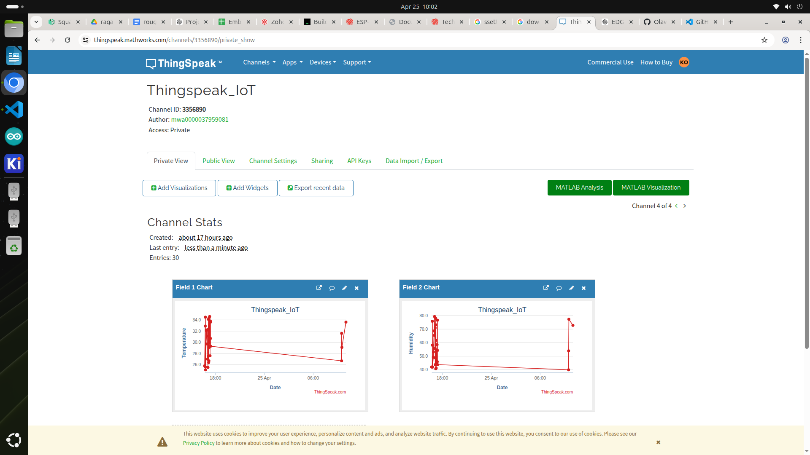

#  IoT ThingSpeak Monitoring System

A simple IoT project built with **PlatformIO**, **ESP32/ESP8266**, and **ThingSpeak** for real-time sensor data monitoring.

---

## Features

* WiFi-enabled data transmission
* Real-time data visualization using ThingSpeak
* Modular PlatformIO project structure
* Secure API key handling (via secrets file)
* Compatible with ESP32 and ESP8266
## 📊 Dashboard Preview




---

## Tech Stack

* PlatformIO (VS Code)
* C++ (Arduino Framework)
* ESP32 / ESP8266
* ThingSpeak Cloud
* NVIDIA DGX Spark (Development Environment)

---

## How It Works

1. Sensor collects data (e.g., temperature, humidity)
2. ESP device connects to WiFi
3. Data is sent to ThingSpeak via HTTP
4. ThingSpeak visualizes the data in charts

---

##  Project Structure

```bash
src/        # Main application code
lib/        # External libraries
docs/       # Documentation
```

---

## Setup Instructions

See  [docs/setup.md](docs/setup.md)

---

##  Environment Variables

Create a file:

```cpp
src/secrets.h
```

Example:

```cpp
#define WIFI_SSID "your_wifi"
#define WIFI_PASSWORD "your_password"
#define API_KEY "your_thingspeak_key"
```

---

## ThingSpeak Integration

Data is sent using:

```txt
https://api.thingspeak.com/update
```

---

## Example Output

* Temperature → Field 1
* Humidity → Field 2

---

##  Future Improvements

* Add real sensor (DHT11/DHT22)
* OTA updates
* Dashboard app (React Native)
* AI analytics using DGX Spark

---

## Contributing

Pull requests are welcome. See [CONTRIBUTING.md](CONTRIBUTING.md)

---

## License

MIT License

